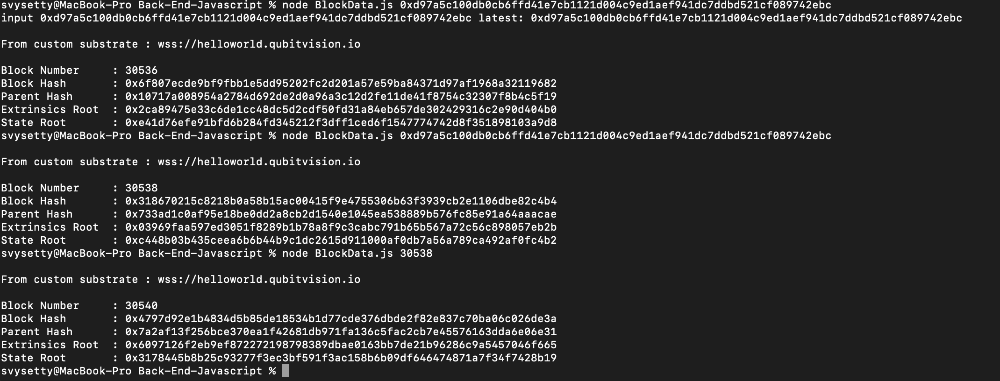

# Back-End-Javascript

## Backend Javascript sample

This is the custom stubstat [instance](https://polkadot.js.org/apps/?rpc=wss%3A%2F%2Fhelloworld.qubitvision.io#) its connecting to 

## Usage:

 terminal> node BlockData.js  block Hash/ Block Number

## examples:

 terminal> node BlockData.js 203 \n

 terminal> node BlockData.js 0x318670215c8218b0a58b15ac00415f9e4755306b63f3939cb2e1106dbe82c4b4 \n

